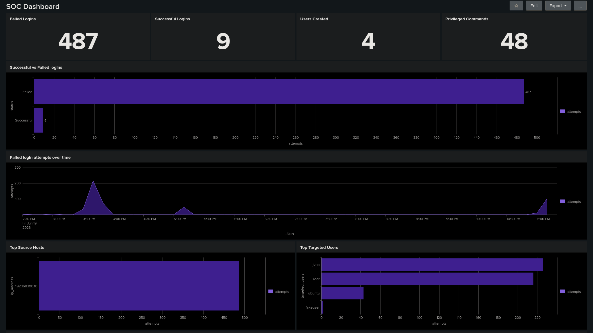
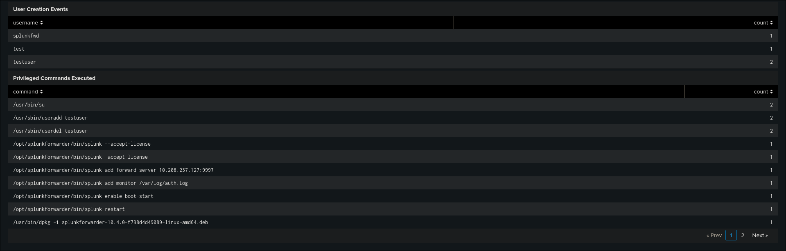
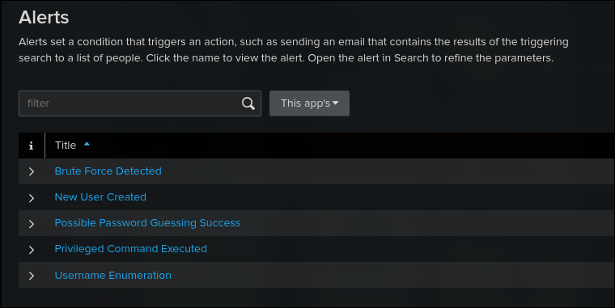
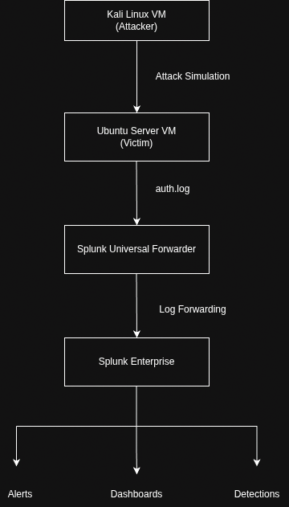

# SOC Detection Lab

A home SOC environment built with Splunk Enterprise, Kali Linux, and Ubuntu Server to simulate, detect, and respond to common Linux attack scenarios. The lab focuses on generating realistic attack telemetry, developing detections, creating alerts, and documenting investigation procedures through analyst playbooks and dashboards.

**Stack:** Splunk Enterprise · Splunk Universal Forwarder · Kali Linux · Ubuntu Server · VirtualBox

## Contents
* [Screenshots](#screenshots)
* [Architecture](#architecture)
* [Lab Environment](#lab-environment)
* [Attack Scenarios](#attack-scenarios)
* [Detections](#detections)
* [MITRE ATT&CK Mapping](#mitre-attck-mapping)
* [Alerts](#alerts)
* [Dashboard](#dashboard)
* [Repository Structure](#repository-structure)

## Screenshots

### Dashboard



### Alerts


## Architecture

* **Kali Linux VM** — attacker, used to simulate brute force, enumeration, and post-exploitation activity
* **Ubuntu Server VM** — victim, generates auth and system logs
* **Splunk Universal Forwarder** — installed on the victim, forwards `/var/log/auth.log` (and related logs) to Splunk
* **Splunk Enterprise** — SIEM platform for indexing, detection, alerting, and dashboarding



## Lab Environment

| Component                  | Purpose           |
| -------------------------- | ------------------ |
| Kali Linux                 | Attack simulation  |
| Ubuntu Server              | Victim system      |
| Splunk Universal Forwarder | Log collection     |
| Splunk Enterprise          | SIEM platform      |
| VirtualBox                 | Virtualization     |

## Attack Scenarios

| Scenario                       | Description |
| ------------------------------- | ----------- |
| SSH Brute Force                 | Repeated failed SSH logins against a single host from one source IP |
| Password Guessing Success       | A failed-login streak followed by a successful authentication from the same source |
| Username Enumeration            | Sequential login attempts across multiple usernames from the same source IP |
| User Creation                   | New local user accounts created on the victim host |
| Privileged Command Execution    | Use of `sudo` or other privileged commands following authentication |

## Detections

Each detection below was built as a Splunk search and tuned against the generated telemetry to balance true-positive coverage with alert noise.

**Example — SSH Brute Force Detection:**
```spl
index=main host="Ubuntu" "Failed password"
| rex "from (?<src_ip>\d+\.\d+\.\d+\.\d+)"
| stats count by src_ip
| where count >= 10
```

Full writeups (including thresholds, rationale, and false-positive considerations) for every detection are in [detections](./detections). 

Step-by-step analyst response procedures are in [playbooks](./playbooks). 

Full lab build instructions are in [setup.md](./docs/setup.md).

## MITRE ATT&CK Mapping

| Attack Scenario              | Tactic              | Technique |
| ------------------------------ | -------------------- | --------- |
| SSH Brute Force                | Credential Access     | T1110.001 – Brute Force: Password Guessing |
| Password Guessing Success      | Initial Access        | T1078 – Valid Accounts |
| Username Enumeration | Reconnaissance | T1589 – Gather Victim Identity Information |
| User Creation                  | Persistence           | T1136.001 – Create Account: Local Account |
| Privileged Command Execution   | Privilege Escalation  | T1548.003 – Abuse Elevation Control Mechanism: Sudo |

## Alerts

Each detection above has a corresponding Splunk alert, scheduled on a recurring search with thresholds tuned to the detection logic:

* SSH Brute Force Detection
* Password Guessing Success
* Username Enumeration
* User Creation
* Privileged Command Execution

Alerts trigger when detection thresholds are exceeded and are available through the Splunk alerting interface for analyst review.

## Dashboard

A custom SOC dashboard visualizes:

* Failed login attempts over time
* Successful logins
* Source IP activity
* Targeted usernames
* User creation events
* Privileged command usage

The dashboard provides visibility into authentication activity, attack simulations, and detection results across the lab environment.

## Repository Structure

```text
soc-lab/
├── architecture/
│   └── architecture.png
├── detections/
│   ├── brute_force.md
│   ├── password_guessing_success.md
│   ├── privileged_command_execution.md
│   ├── user_creation.md
│   └── username_enumeration.md
├── docs/
│   └── setup.md
├── playbooks/
│   ├── password_guessing_playbook.md
│   ├── privileged_command_playbook.md
│   ├── ssh-bruteforce.md
│   ├── user_creation_playbook.md
│   └── username_enumeration_playbook.md
├── screenshots/
└── README.md
```

## Key Takeaways

Building this lab reinforced several core SOC concepts:

- The importance of generating realistic telemetry before writing detections.
- How authentication logs can be used to identify brute force, password guessing, and account creation activity.
- The difference between creating a detection and creating an actionable analyst workflow through alerts and playbooks.
- The value of threshold tuning to reduce false positives while maintaining visibility into suspicious activity.
