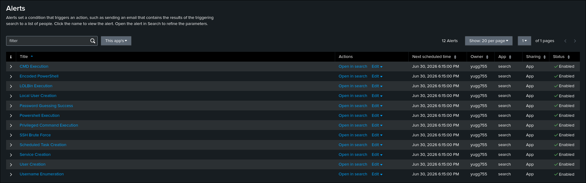
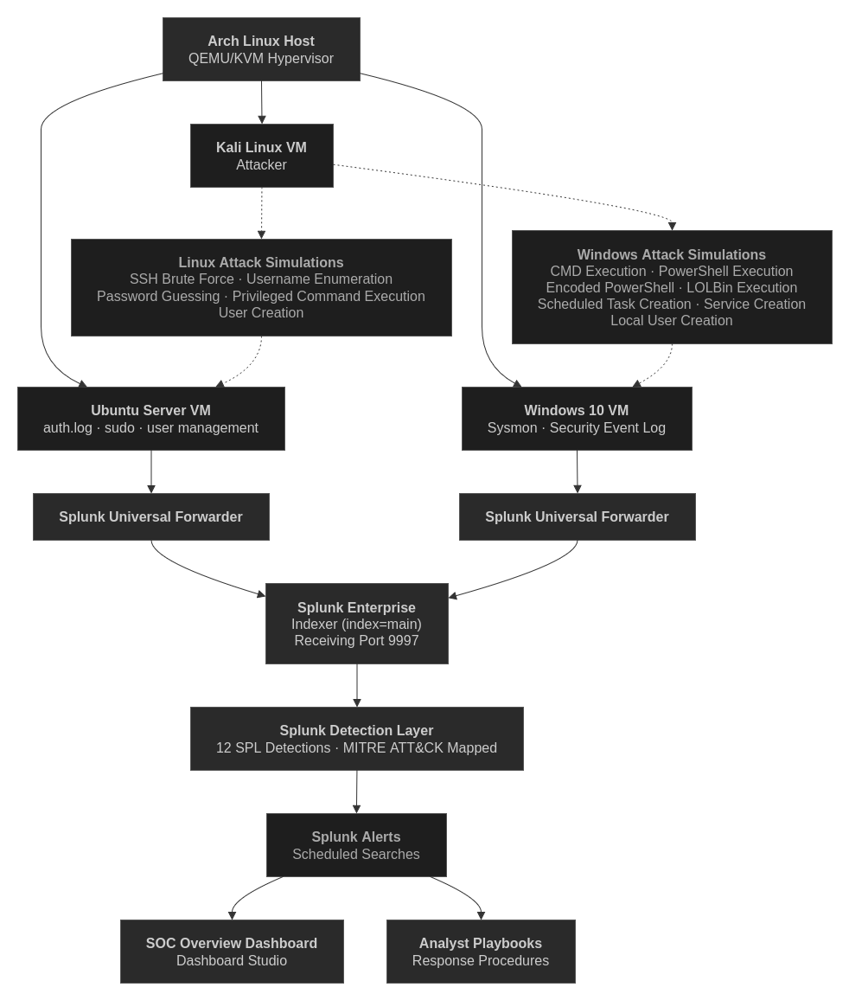

# SOC Detection Lab

A Security Operations Center (SOC) detection engineering lab built with Splunk Enterprise. Simulates real-world attacker activity across Windows and Linux endpoints to build and validate a full detection pipeline (MITRE-mapped detections, alerts, and analyst playbooks) using real endpoint telemetry, not synthetic events.

- **12** documented detections, MITRE ATT&CK-mapped
- **12** analyst playbooks, **12** scheduled alerts
- Cross-platform telemetry: Sysmon, Windows Security Logs, Linux auth.log
- Attacks executed from a dedicated Kali Linux attacker VM
- Interactive SOC Overview Dashboard (Splunk Dashboard Studio)

## Table of Contents

- [Preview](#preview)
- [Architecture](#architecture)
- [Detection Workflow](#detection-workflow)
- [Detection Coverage](#detection-coverage)
- [Features](#features)
- [Project Structure](#project-structure)
- [Documentation](#documentation)
- [Setup](#setup)
- [Project Statistics](#project-statistics)

## Preview

### SOC Overview Dashboard
Centralized operational view of the environment — authentication activity, endpoint telemetry, persistence events, and high-level KPIs.


### Linux Authentication Monitoring
SSH authentication failures, password guessing activity, username enumeration, and other Linux-specific detections.


### Windows Endpoint Monitoring
Sysmon process execution telemetry, persistence-related activity, and suspicious command execution.


### Alert Overview
Every documented detection has an associated scheduled Splunk alert, used to validate the full detection pipeline end-to-end.



## Architecture

A centralized Splunk Enterprise deployment runs on an Arch Linux host. Windows 10 and Ubuntu Server endpoints forward telemetry through Splunk Universal Forwarders, while a dedicated Kali Linux VM generates attack activity used to validate detections, alerts, dashboards, and playbooks.



Full breakdown in [docs/architecture.md](docs/architecture.md).

## Detection Workflow

Each detection follows the same validation loop: simulate the attack from Kali → generate real telemetry on the target endpoint → Splunk indexes and runs the SPL detection → alert fires → playbook documents the analyst response.


Full breakdown in [docs/workflow.md](docs/workflow.md).

## Detection Coverage

| Platform | Detection | Data Source | ATT&CK Technique |
|----------|-----------|-------------|------------------|
| Windows | PowerShell Execution | Sysmon – Process Creation | T1059.001 |
| Windows | Encoded PowerShell | Sysmon – Process Creation | T1059.001 |
| Windows | CMD Execution | Sysmon – Process Creation | T1059.003 |
| Windows | LOLBin Execution | Sysmon – Process Creation | T1218, T1105, T1197 |
| Windows | Scheduled Task Creation | Sysmon – Process Creation | T1053.005 |
| Windows | Service Creation | Sysmon – Process Creation | T1543.003 |
| Windows | Local User Creation | Windows Security Log | T1136.001 |
| Linux | SSH Brute Force | Linux Auth Log | T1110.001 |
| Linux | Password Guessing Success | Linux Auth Log | T1110.001 |
| Linux | Username Enumeration | Linux Auth Log | T1589.001 |
| Linux | User Creation | Linux Auth Log | T1136.001 |
| Linux | Privileged Command Execution | Linux Auth Log | T1548.003 |

## Features

### Detection Engineering
- 12 production-style SPL detections covering Windows and Linux attack scenarios
- Detection tuning guidance and false positive considerations
- MITRE ATT&CK technique and tactic mappings

### Endpoint Monitoring
- Windows: Sysmon – Process Creation, Windows Security Log
- Linux: Linux Auth Log (SSH, user management, privilege escalation)
- Centralized collection through Splunk Universal Forwarders

### Alerting
- Scheduled Splunk alert for every documented detection
- Alert severity classification based on detection context
- Alert config documented alongside each detection

### SOC Dashboard
- Built with Splunk Dashboard Studio
- Environment summary KPIs, Linux + Windows monitoring panels
- Interactive filtering by OS and time range

### Documentation
- Per-detection docs: objective, SPL query, validation, tuning, references
- Analyst investigation playbook for every detection
- Architecture, workflow, setup, telemetry, and dashboard docs

## Project Structure

```text
soc-detection-lab/
├── detections/                 # Detection documentation
├── playbooks/                  # Analyst investigation playbooks
├── diagrams/                   # Architecture and workflow diagrams
├── screenshots/
├── docs/
│   ├── architecture.md         # Lab architecture
│   ├── dashboards.md           # Dashboard implementation
│   ├── detections.md           # Detection catalog
│   ├── setup.md                # Environment deployment
│   ├── telemetry.md            # Collected telemetry
│   └── workflow.md             # Detection validation workflow
└── README.md
```

## Documentation

| Document | Description |
|----------|-------------|
| [Setup](docs/setup.md) | Deploy and configure the lab environment |
| [Architecture](docs/architecture.md) | Infrastructure and data flow |
| [Workflow](docs/workflow.md) | Detection validation workflow |
| [Telemetry](docs/telemetry.md) | Collected telemetry and data sources |
| [Detection Catalog](docs/detections.md) | Overview of all implemented detections |
| [Dashboard](docs/dashboards.md) | Dashboard Studio implementation |
| [Detections](detections/) | Individual detection documentation |
| [Playbooks](playbooks/) | Analyst investigation procedures |

## Setup

```bash
git clone https://github.com/yugg755i/soc-detection-lab.git
cd soc-detection-lab
```

Then:
- Install Splunk Enterprise
- Configure Splunk Universal Forwarders
- Deploy Sysmon on Windows
- Configure Ubuntu log forwarding
- Validate telemetry ingestion

Full deployment instructions in [docs/setup.md](docs/setup.md).

## Project Statistics

| Metric | Value |
| --- | ---: |
| Monitored Endpoints | 2 |
| Attacker VM | 1 |
| Detection Rules | 12 |
| Analyst Playbooks | 12 |
| Scheduled Alerts | 12 |
| Dashboard Studio Dashboards | 1 |
| Windows Detections | 7 |
| Linux Detections | 5 |
| Primary Data Sources | Sysmon, Windows Security, auth.log |
| Detection Framework | MITRE ATT&CK |
