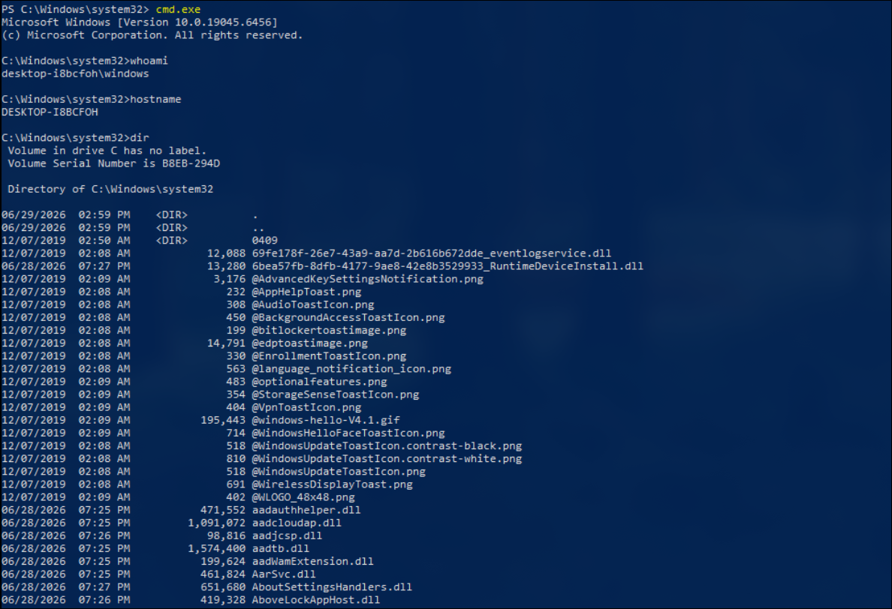
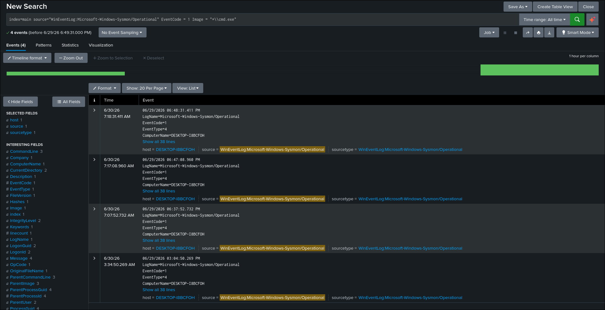
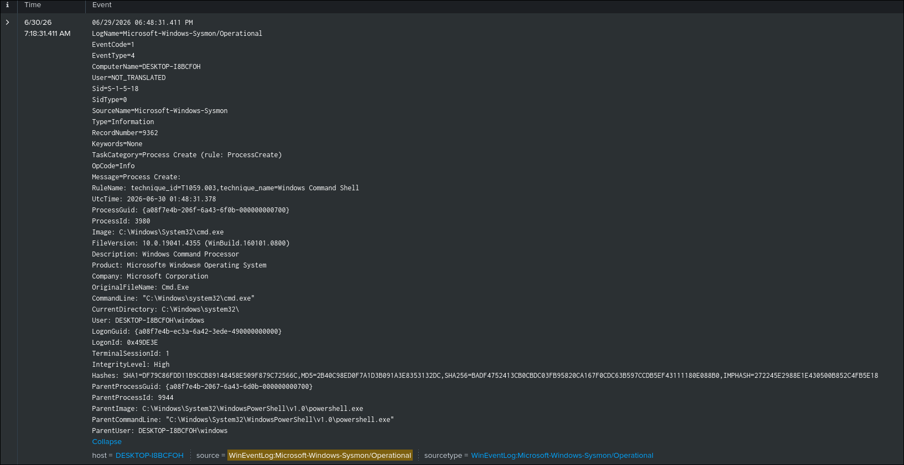
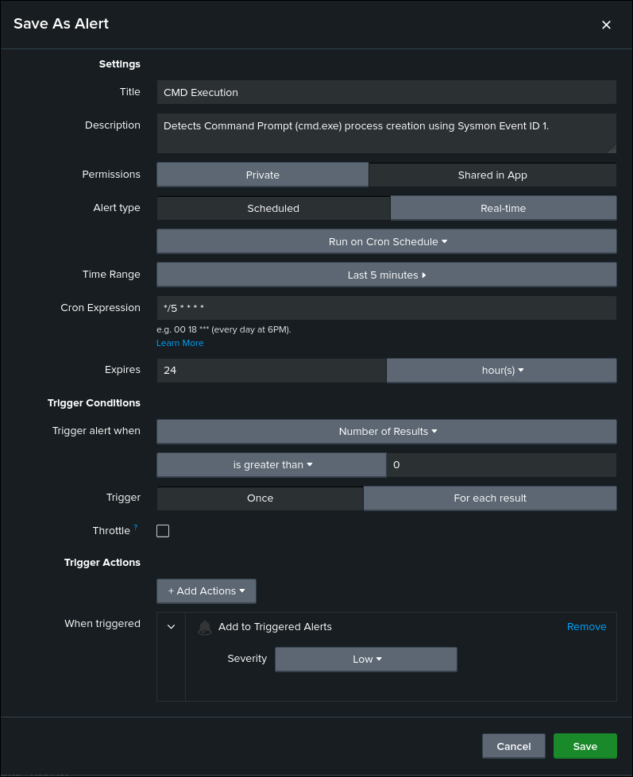

# CMD Execution Detection

## Objective

Detect the execution of Command Prompt (`cmd.exe`) processes on Windows endpoints using Sysmon process creation events.

## ATT&CK

**Technique**

* T1059.003 — Windows Command Shell

**Tactic**

* Execution

## Data Source

* Microsoft Sysmon
* Event ID 1 — Process Creation

## Attack Simulation

The following commands were executed to generate telemetry:

```cmd
cmd.exe
```

```cmd
whoami
```

```cmd
hostname
```

## Detection Logic

The detection searches Sysmon Process Creation (Event ID 1) events and identifies executions of the Windows Command Prompt (`cmd.exe`).

Because Command Prompt is a common Windows command interpreter used by both administrators and attackers, this detection provides baseline visibility into command-line activity and serves as a foundation for more specific detections involving suspicious commands or process chains.

## SPL Query

```spl
index=main source="WinEventLog:Microsoft-Windows-Sysmon/Operational" EventCode=1
Image="*\\cmd.exe"
```

## Expected Output

The search returns Sysmon Event ID 1 events where the executed process is `cmd.exe`.

The event includes useful investigation fields such as:

* Image
* CommandLine
* ParentImage
* User
* IntegrityLevel
* ProcessId
* Hashes

## Validation

The detection was validated by launching Command Prompt on the Windows endpoint and executing basic commands while confirming that the corresponding Sysmon Process Creation events were successfully ingested into Splunk.

## Detection Tuning

Consider excluding known administrative activity, including:

* Windows Terminal
* Visual Studio
* Enterprise management tools
* Approved administrative automation
* Build and deployment tools

## False Positives

Potential false positives include:

* IT administrative activity
* Software installation scripts
* Configuration management tools
* Build and deployment processes
* Legitimate user activity

## MITRE Mapping

* T1059.003 — Windows Command Shell

## References

* MITRE ATT&CK – https://attack.mitre.org/techniques/T1059/003/
* Microsoft Sysmon Documentation – https://learn.microsoft.com/sysinternals/downloads/sysmon

## Screenshots

| Screenshot    | Preview                                                          |
| ------------- | ---------------------------------------------------------------- |
| Execution     |          |
| Search |  |
| Raw Event     |          |
| Alert Configuration |  |
