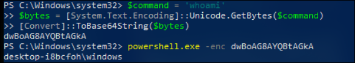
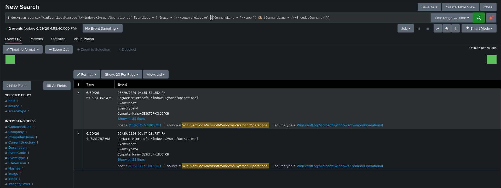
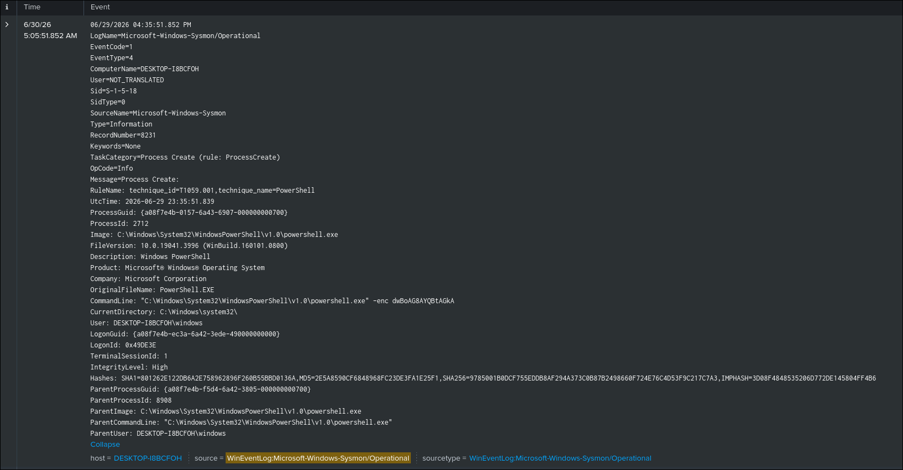
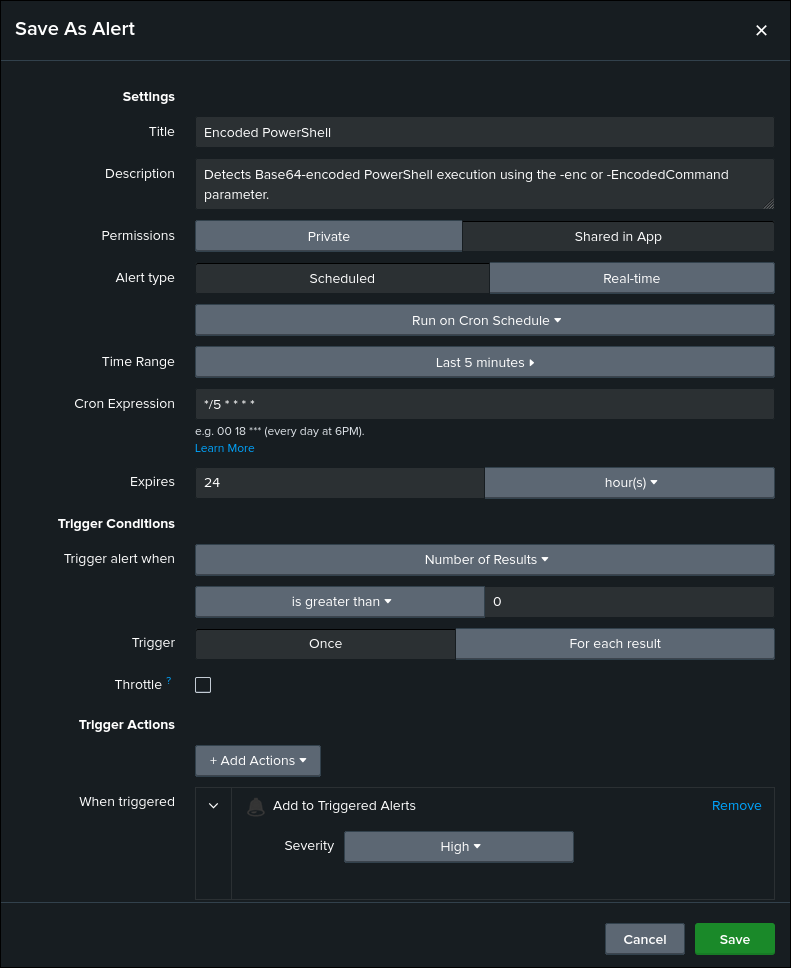

# Encoded PowerShell Detection

## Objective

Detect the execution of Base64-encoded PowerShell commands on Windows endpoints using Sysmon process creation events.

## ATT&CK

**Technique**

* T1059.001 — PowerShell

**Tactic**

* Execution

## Data Source

* Microsoft Sysmon
* Event ID 1 — Process Creation

## Attack Simulation

The following command was executed to generate telemetry:

```powershell
powershell.exe -enc dwBoAG8AYQBtAGkA
```

The Base64-encoded command executes:

```powershell
whoami
```

## Detection Logic

The detection searches Sysmon Process Creation (Event ID 1) events for PowerShell executions that include the `-enc` or `-EncodedCommand` parameter in the command line.

Attackers commonly encode PowerShell commands to obfuscate malicious activity and evade simple string-based detections. Monitoring encoded PowerShell execution provides visibility into a frequently abused attacker technique.

## SPL Query

```spl
index=main source="WinEventLog:Microsoft-Windows-Sysmon/Operational" EventCode=1
Image="*\\powershell.exe"
(CommandLine="*-enc*" OR CommandLine="*-EncodedCommand*")
```

## Expected Output

The search returns Sysmon Event ID 1 events where PowerShell is executed using the `-enc` or `-EncodedCommand` parameter.

The event includes useful investigation fields such as:

* Image
* CommandLine
* ParentImage
* User
* IntegrityLevel
* ProcessId
* Hashes

## Validation

The detection was validated by executing a Base64-encoded PowerShell command on the Windows endpoint and confirming that the corresponding Sysmon Process Creation event was successfully ingested into Splunk.

## Detection Tuning

Consider excluding known administrative activity, including:

* SCCM
* Microsoft Defender
* Backup software
* Approved administrative automation
* Enterprise management tools

## False Positives

Potential false positives include:

* IT administrative automation
* Configuration management tools
* Endpoint management software
* Security testing
* Legitimate scripts that use encoded PowerShell commands

## MITRE Mapping

* T1059.001 — PowerShell

## References

* MITRE ATT&CK – https://attack.mitre.org/techniques/T1059/001/
* Microsoft Sysmon Documentation – https://learn.microsoft.com/sysinternals/downloads/sysmon

## Screenshots

| Screenshot    | Preview                                                               |
| ------------- | --------------------------------------------------------------------- |
| Execution     |          |
| Search |  |
| Raw Event     |          |
| Alert Configuration |  |
