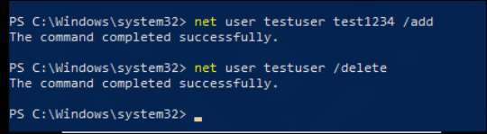
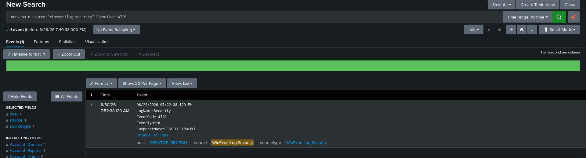
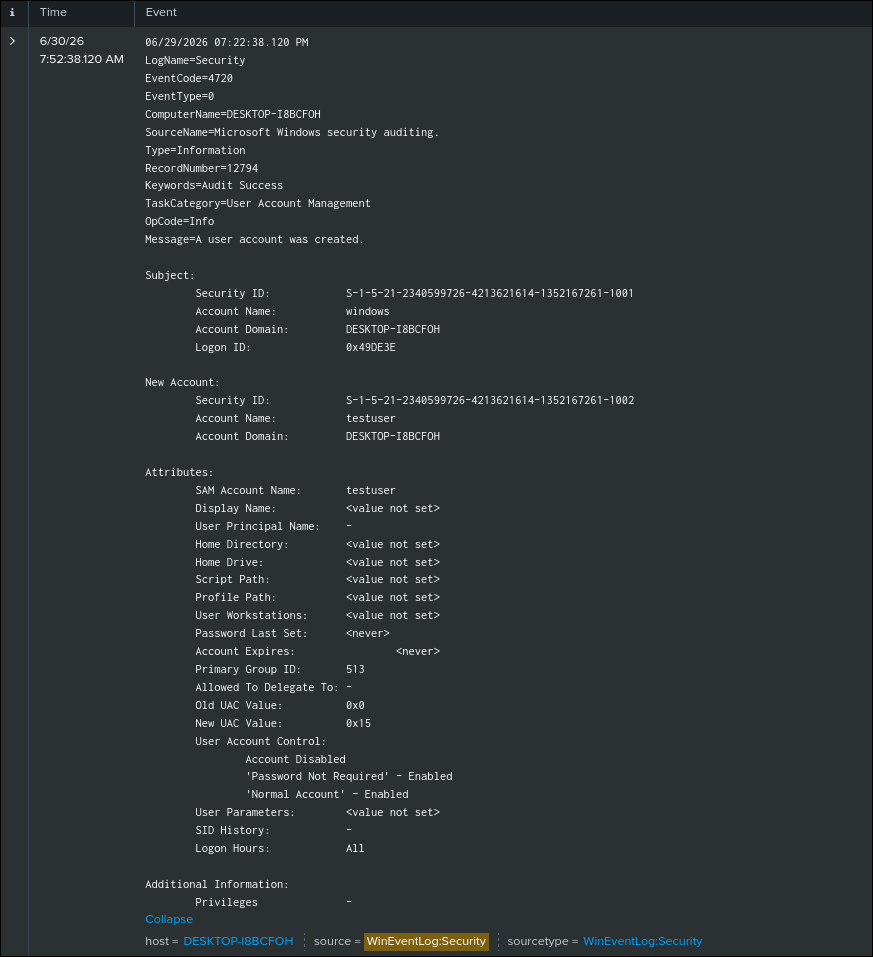
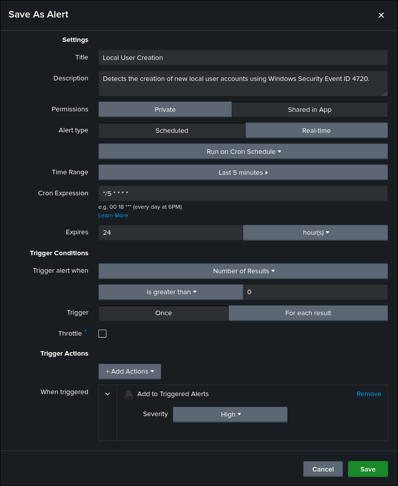

# Local User Creation Detection

## Objective

Detect the creation of new local user accounts on Windows endpoints using Windows Security auditing events.

## ATT&CK

**Technique**

* T1136.001 — Create Account: Local Account

**Tactic**

* Persistence

## Data Source

* Windows Security Log
* Event ID 4720 — A User Account Was Created

## Attack Simulation

The following command was executed to generate telemetry:

```powershell
net user testuser test1234 /add
```

The test account was removed after validation:

```powershell
net user testuser /delete
```

## Detection Logic

The detection monitors Windows Security Event ID 4720, which is generated whenever a new local user account is created.

Unlike process-based detections, Event ID 4720 records the account creation regardless of the tool used (such as `net.exe`, PowerShell, Computer Management, or Windows APIs), providing reliable visibility into account creation activity.

## SPL Query

```spl
index=main source="WinEventLog:Security" EventCode=4720
```

## Expected Output

The search returns Windows Security Event ID 4720 whenever a local user account is created.

The event includes useful investigation fields such as:

- SubjectUserName
- Account_Name
- SAM_Account_Name
- Account_Domain
- UserAccountControl
- ComputerName

## Validation

The detection was validated by creating a local user account using the `net user` command and confirming that the corresponding Windows Security event was successfully ingested into Splunk.

## Detection Tuning

Consider excluding:

* Approved provisioning scripts
* Enterprise identity management solutions
* Automated deployment workflows
* Authorized administrative account creation

## False Positives

Potential false positives include:

* IT administrators
* Help desk account provisioning
* Automated deployment tools
* Legitimate account management activities

## MITRE Mapping

* T1136.001 — Create Account: Local Account

## References

- MITRE ATT&CK – https://attack.mitre.org/techniques/T1136/001/
- Microsoft Event ID 4720 Documentation – https://learn.microsoft.com/windows/security/threat-protection/auditing/event-4720

## Screenshots

| Screenshot | Preview |
|------------|---------|
| Execution |  |
| Splunk Search |  |
| Raw Event |  |
| Alert Configuration |  |
