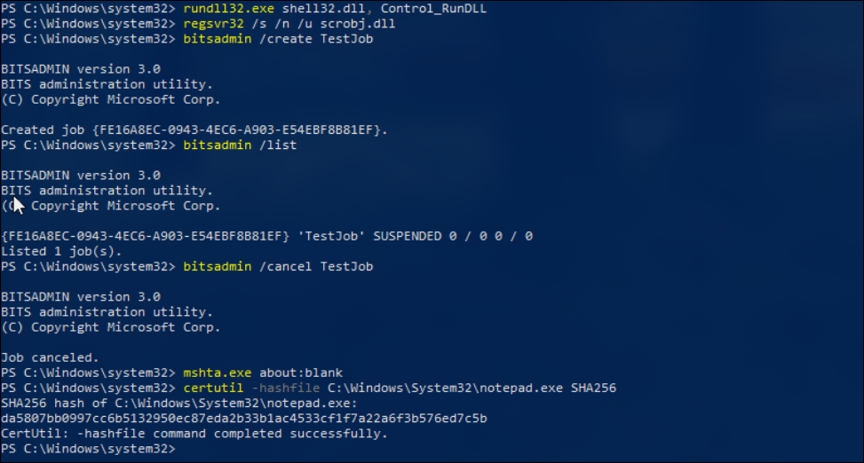
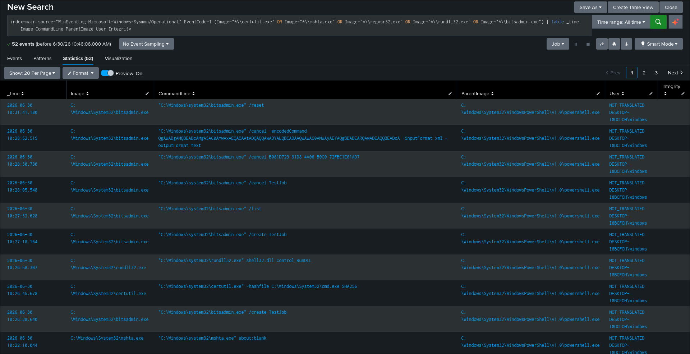
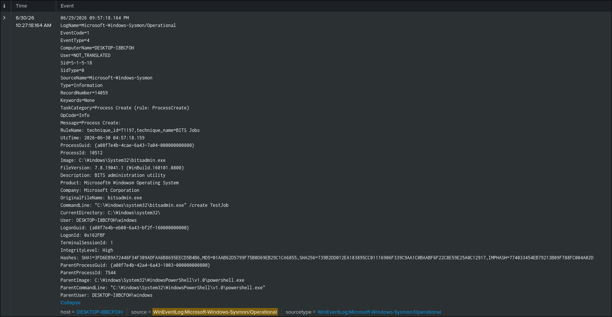

# LOLBin Execution Detection

## Objective

Detect the execution of common Living-off-the-Land Binaries (LOLBins) on Windows endpoints using Sysmon Process Creation events.

## ATT&CK

**Techniques**

- T1218 — System Binary Proxy Execution
- T1105 — Ingress Tool Transfer (Certutil)
- T1197 — BITS Jobs

**Tactics**

- Defense Evasion
- Execution
- Command and Control

## Data Source

- Microsoft Sysmon
- Event ID 1 — Process Creation

## Attack Simulation

The following LOLBins were executed to generate telemetry:

```powershell
certutil.exe -hashfile C:\Windows\System32\notepad.exe SHA256

rundll32.exe shell32.dll,Control_RunDLL

regsvr32.exe /s /n /u scrobj.dll

bitsadmin.exe /create TestJob
bitsadmin.exe /list
bitsadmin.exe /cancel TestJob

mshta.exe about:blank
```

## Detection Logic

The detection monitors Sysmon Process Creation events (Event ID 1) and identifies executions of common Windows Living-off-the-Land Binaries (LOLBins).

LOLBins are legitimate Windows utilities that attackers frequently abuse to execute code, evade defenses, download payloads, or perform post-exploitation activities.

## SPL Query

```spl
index=main source="WinEventLog:Microsoft-Windows-Sysmon/Operational" EventCode=1
(Image="*\\certutil.exe"
OR Image="*\\mshta.exe"
OR Image="*\\regsvr32.exe"
OR Image="*\\rundll32.exe"
OR Image="*\\bitsadmin.exe")
```

## Expected Output

The search returns Sysmon Event ID 1 events where one of the monitored LOLBins is executed.

The event includes useful investigation fields such as:

- Image
- CommandLine
- ParentImage
- User
- IntegrityLevel
- ProcessId
- Hashes

## Validation

The detection was validated by executing the listed LOLBins on the Windows endpoint and confirming that the corresponding Sysmon Process Creation events were successfully ingested into Splunk.

## Detection Tuning

Consider excluding known administrative activity, including:

- Enterprise management tools
- Approved administration scripts
- Backup software
- Endpoint security products
- Software deployment tools

## False Positives

Potential false positives include:

- IT administration
- Software installation
- Enterprise automation
- Windows troubleshooting
- Security tools

## MITRE Mapping

- T1218 — System Binary Proxy Execution
- T1105 — Ingress Tool Transfer
- T1197 — BITS Jobs

## References

- MITRE ATT&CK – https://attack.mitre.org/
- Microsoft Sysmon Documentation – https://learn.microsoft.com/sysinternals/downloads/sysmon

## Screenshots

| Screenshot | Preview |
|------------|---------|
| Execution |  |
| Search |  |
| Raw Event |  |
