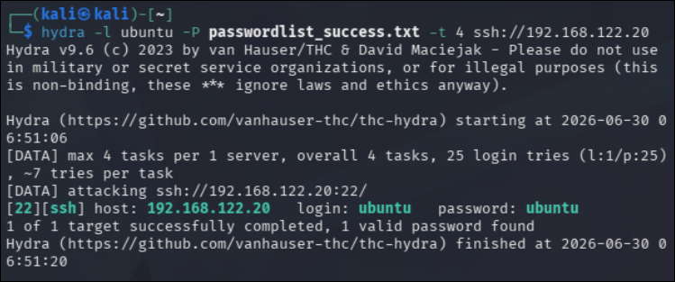
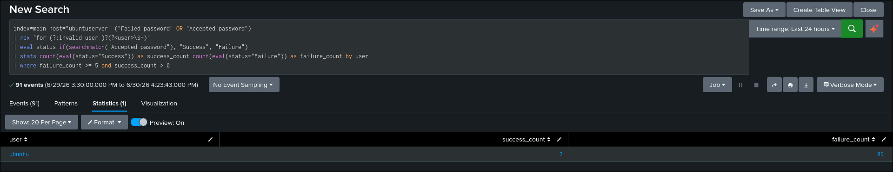
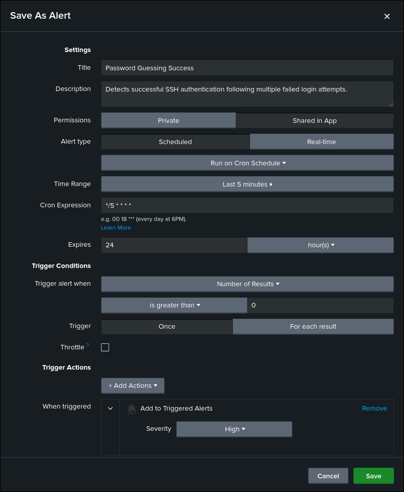

# Password Guessing Success Detection

## Objective

Detect successful SSH authentication following multiple failed login attempts for the same user.

## ATT&CK

**Technique**

* T1110.001 — Password Guessing

**Tactic**

* Credential Access

## Data Source

* Ubuntu Authentication Log (`/var/log/auth.log`)
* Splunk Universal Forwarder

## Attack Simulation

The following command was executed from the Kali Linux attacker machine to generate telemetry:

```bash
hydra -l ubuntu -P passwordlist_success.txt -t 4 ssh://192.168.122.20
```

## Detection Logic

The detection searches Ubuntu authentication logs for both failed and successful SSH authentication events. Events are grouped by username, and the number of failed and successful authentication attempts is calculated.

If a user generates five or more failed login attempts followed by at least one successful authentication, the activity is flagged as a potential password guessing attack.

## SPL Query

```spl
index=main host="ubuntuserver" ("Failed password" OR "Accepted password")
| rex "for (?:invalid user )?(?<user>\S+)"
| eval status=if(searchmatch("Accepted password"), "Success", "Failure")
| stats count(eval(status="Success")) as success_count count(eval(status="Failure")) as failure_count by user
| where failure_count >= 5 and success_count > 0
```

## Expected Output

The search returns user accounts that successfully authenticated after multiple failed SSH login attempts.

Useful investigation fields include:

- user
- success_count
- failure_count
- host
- _time
- _raw

## Validation

The detection was validated by performing a password guessing attack from the Kali Linux attacker machine using Hydra and confirming that the corresponding authentication events were successfully ingested into Splunk.

## Detection Tuning

Consider excluding:

* Approved penetration testing
* Internal vulnerability assessments
* Authorized password auditing
* Security validation exercises

Adjust the failed authentication threshold as appropriate for the environment.

## False Positives

Potential false positives include:

* Authorized password auditing
* Internal security testing
* User authentication testing
* Credential validation performed by administrators

## MITRE Mapping

* T1110.001 — Password Guessing

## References

- MITRE ATT&CK – https://attack.mitre.org/techniques/T1110/001/
- Hydra Documentation – https://github.com/vanhauser-thc/thc-hydra

## Screenshots

| Screenshot | Preview |
|------------|---------|
| Execution |  |
| Search |  |
| Raw Event |  |
| Alert Configuration |  |
