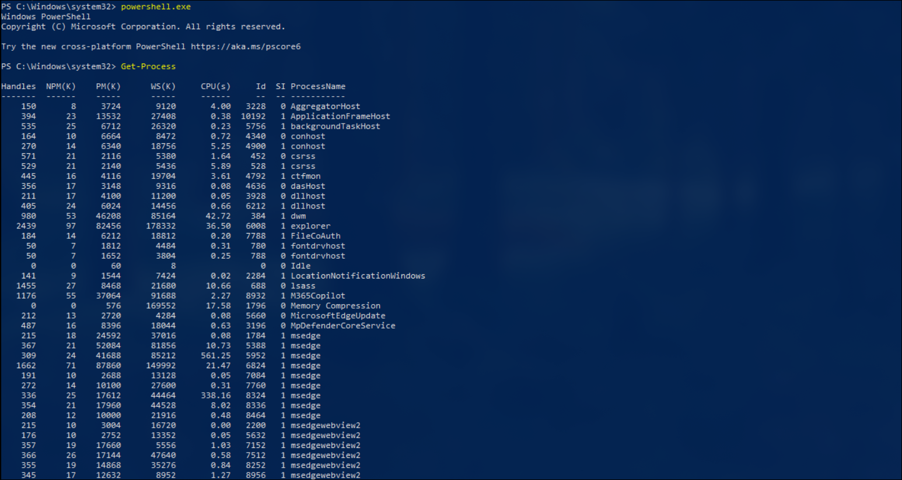
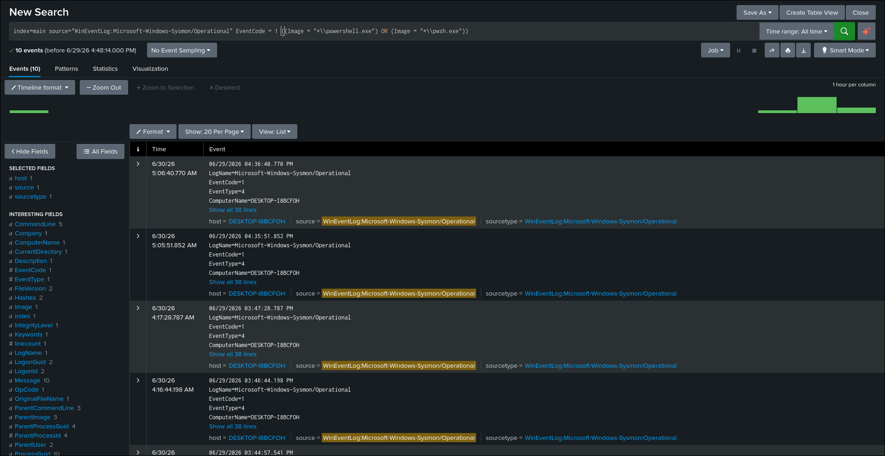
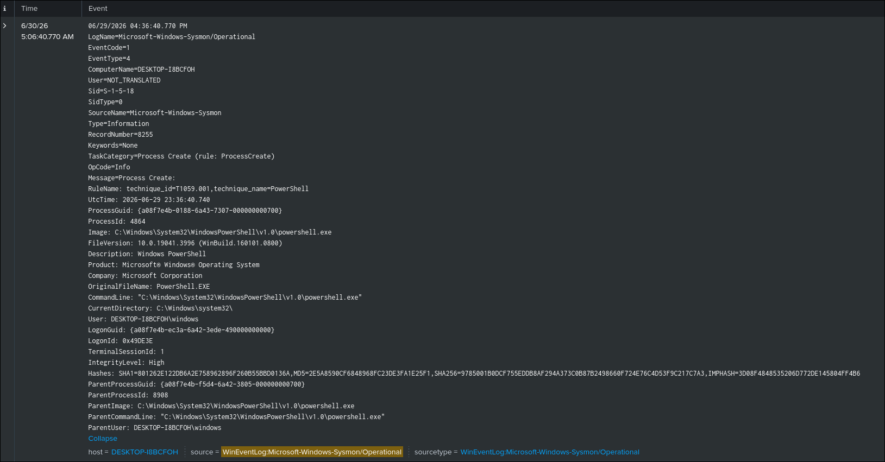

# PowerShell Execution Detection

## Objective

Detect the execution of PowerShell processes on Windows endpoints using Sysmon process creation events.

## ATT&CK

**Technique**

* T1059.001 — PowerShell

**Tactic**

* Execution

## Data Source

* Microsoft Sysmon
* Event ID 1 — Process Creation

## Attack Simulation

The following commands were executed to generate telemetry:

```powershell
powershell.exe
```

```powershell
pwsh.exe
```

```powershell
powershell.exe -Command whoami

powershell.exe -Command Get-Process
```

## Detection Logic

The detection searches Sysmon Process Creation (Event ID 1) events and identifies executions of powershell.exe or pwsh.exe. Because every PowerShell session creates a process, this detection provides broad visibility into PowerShell usage on Windows endpoints and serves as a foundation for more specific detections such as encoded commands or suspicious PowerShell execution.

Both Windows PowerShell (`powershell.exe`) and PowerShell Core (`pwsh.exe`) are included to provide broader coverage across Windows environments.

## SPL Query

```spl
index=main source="WinEventLog:Microsoft-Windows-Sysmon/Operational" EventCode=1
(Image="*\\powershell.exe" OR Image="*\\pwsh.exe")
```

## Expected Output

The search returns Sysmon Event ID 1 events where the executed process is either
`powershell.exe` or `pwsh.exe`.

The event includes useful investigation fields such as:

- Image
- CommandLine
- ParentImage
- User
- IntegrityLevel
- ProcessId
- Hashes

## Validation

The detection was validated by executing PowerShell commands on the Windows endpoint and confirming that the corresponding Sysmon Process Creation events were successfully ingested into Splunk.

## Detection Tuning

Consider excluding known administrative activity, including:

* SCCM
* Microsoft Defender
* Backup software
* Approved administrative automation
* Enterprise management tools

## False Positives

Potential false positives include:

* IT administrative activity
* Login scripts
* Configuration management tools
* Endpoint monitoring software
* Legitimate PowerShell automation

## MITRE Mapping

* T1059.001 — PowerShell

## References

* MITRE ATT&CK — T1059.001
* Microsoft Sysmon Documentation

## Screenshots




