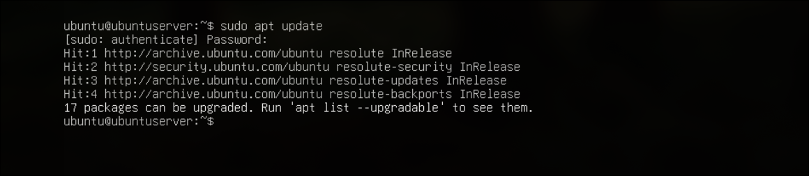
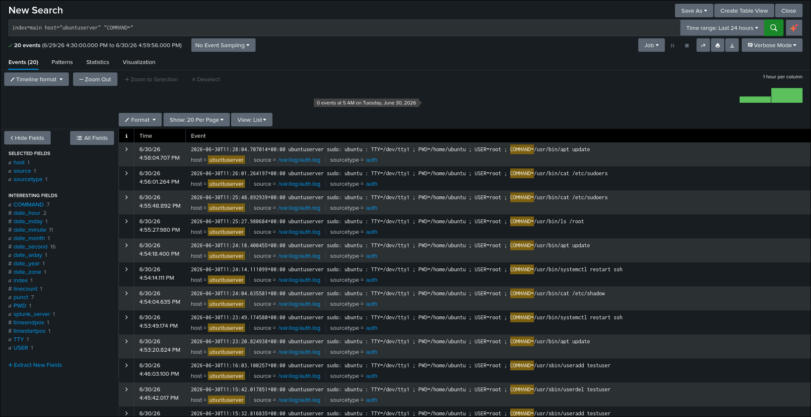
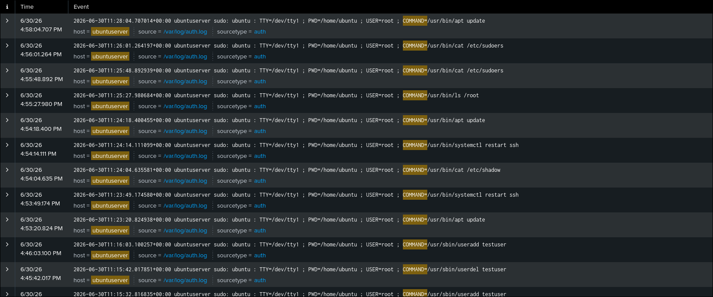
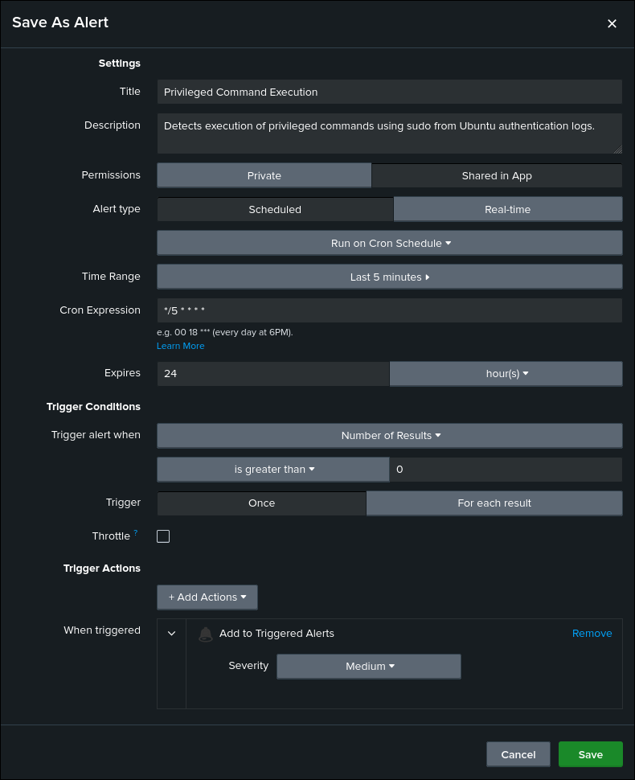

# Privileged Command Execution Detection

## Objective

Detect the execution of privileged commands using `sudo` on the Ubuntu server.

## ATT&CK

**Technique**

* T1548.003 — Sudo and Sudo Caching

**Tactic**

* Privilege Escalation

## Data Source

* Ubuntu Authentication Log (`/var/log/auth.log`)
* Splunk Universal Forwarder

## Attack Simulation

The following command was executed on the Ubuntu server to generate telemetry:

```bash
sudo apt update
```

## Detection Logic

The detection searches Ubuntu authentication logs for `sudo` events containing the `COMMAND=` field.

These events provide visibility into privileged commands executed by users. Unexpected or unauthorized use of `sudo` may indicate privilege misuse or malicious activity.

## SPL Query

```spl
index=main host="ubuntuserver" "COMMAND="
```

## Expected Output

The search returns authentication events corresponding to commands executed with `sudo`.

Useful investigation fields include:

- host
- _time
- _raw
- source
- sourcetype

## Validation

The detection was validated by executing a privileged command using `sudo` on the Ubuntu server and confirming that the corresponding authentication event was successfully ingested into Splunk.

## Detection Tuning

Consider excluding:

* Routine administrative activity
* Automated maintenance scripts
* Configuration management tools
* Scheduled system administration tasks

## False Positives

Potential false positives include:

* System administrators
* Routine maintenance
* Automated configuration management
* Approved administrative scripts

## MITRE Mapping

* T1548.003 — Sudo and Sudo Caching

## References

- MITRE ATT&CK – https://attack.mitre.org/techniques/T1548/003/
- sudo Manual – https://www.sudo.ws/docs/man/sudo.man/

## Screenshots

| Screenshot | Preview |
|------------|---------|
| Execution |  |
| Search |  |
| Raw Event |  |
| Alert Configuration |  |
