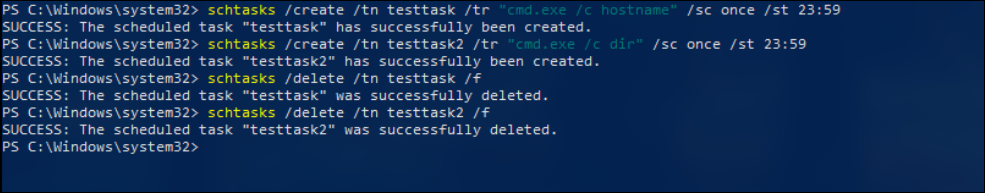
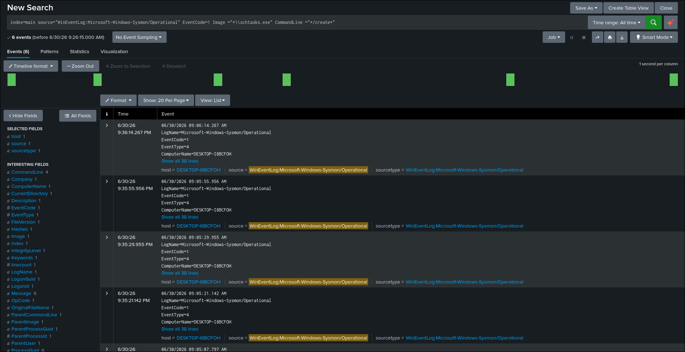
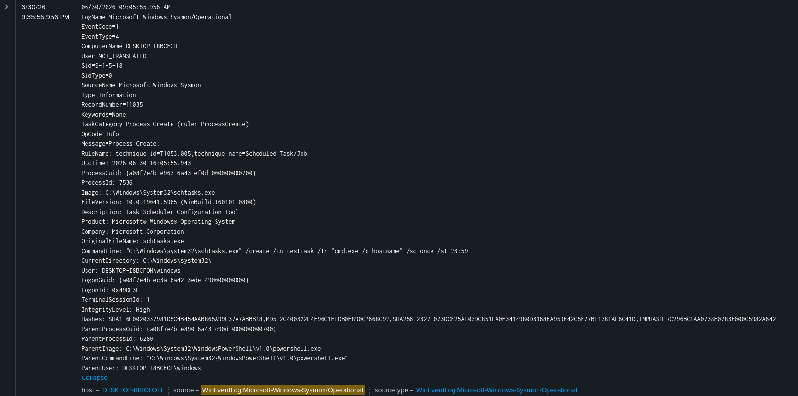

# Scheduled Task Creation Detection

## Objective

Detect the creation of scheduled tasks on Windows endpoints using Sysmon Process Creation events.

## ATT&CK

**Technique**

* T1053.005 — Scheduled Task/Job

**Tactic**

* Execution
* Persistence
* Privilege Escalation

## Data Source

* Microsoft Sysmon
* Event ID 1 — Process Creation

## Attack Simulation

The following command was executed to generate telemetry:

```cmd
schtasks /create /tn TestTask /tr "cmd.exe /c hostname" /sc once /st 23:59
```

The scheduled task was removed after testing:

```cmd
schtasks /delete /tn TestTask /f
```

## Detection Logic

The detection searches Sysmon Process Creation (Event ID 1) events and identifies executions of `schtasks.exe` with the `/create` argument.

Creating scheduled tasks is a common attacker technique used to establish persistence, execute payloads automatically, or maintain access to a compromised system.

Although Windows Security Event ID 4698 also records scheduled task creation, it was not available in this lab because Task Scheduler auditing was not enabled. Therefore, this detection relies on Sysmon telemetry.

## SPL Query

```spl
index=main source="WinEventLog:Microsoft-Windows-Sysmon/Operational" EventCode=1
Image="*\\schtasks.exe"
CommandLine="*/create*"
```

## Expected Output

The search returns Sysmon Event ID 1 events where `schtasks.exe` is executed with the `/create` parameter.

The event includes useful investigation fields such as:

- Image
- CommandLine
- ParentImage
- User
- IntegrityLevel
- ProcessId
- Hashes

## Validation

The detection was validated by creating a scheduled task on the Windows endpoint and confirming that the corresponding Sysmon Process Creation event was successfully ingested into Splunk.

## Detection Tuning

Consider excluding known administrative activity, including:

* Windows Update
* Enterprise management software
* Backup software
* Approved administrative automation
* Endpoint security products

## False Positives

Potential false positives include:

* IT administrative activity
* Scheduled maintenance tasks
* Software installation
* Enterprise management tools
* Backup solutions

## MITRE Mapping

* T1053.005 — Scheduled Task/Job

## References

- MITRE ATT&CK – https://attack.mitre.org/techniques/T1053/005/
- Microsoft Sysmon Documentation – https://learn.microsoft.com/sysinternals/downloads/sysmon

## Screenshots

| Screenshot | Preview |
|------------|---------|
| Execution |  |
| Search |  |
| Raw Event |  |
