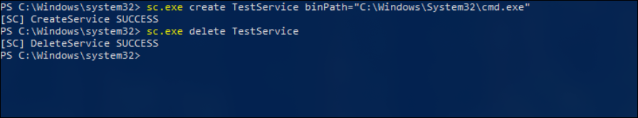
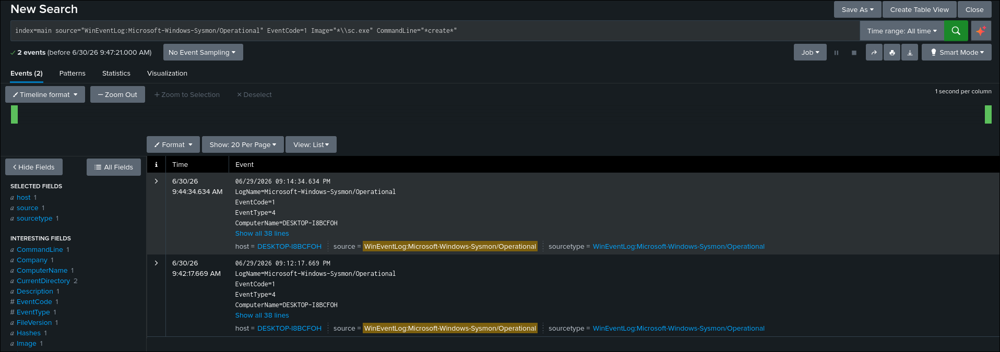
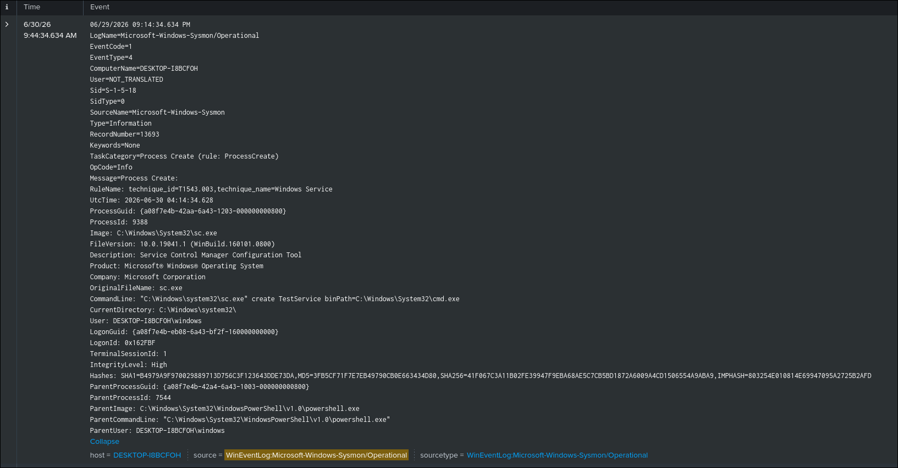
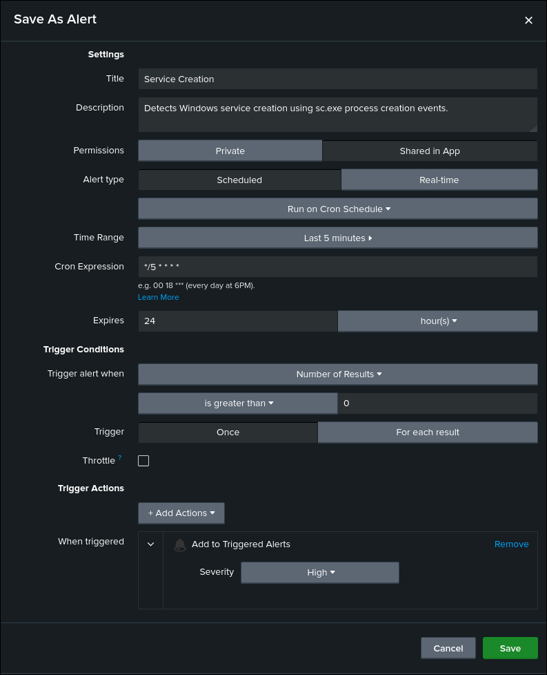

# Service Creation Detection

## Objective

Detect the creation of Windows services using Sysmon Process Creation events.

## ATT&CK

**Technique**

* T1543.003 — Windows Service

**Tactic**

* Persistence
* Privilege Escalation

## Data Source

* Microsoft Sysmon
* Event ID 1 — Process Creation

## Attack Simulation

The following command was executed to generate telemetry:

```cmd
sc.exe create TestService binPath="C:\Windows\System32\cmd.exe"
```

The service was removed after testing:

```cmd
sc.exe delete TestService
```

## Detection Logic

The detection searches Sysmon Process Creation (Event ID 1) events and identifies executions of `sc.exe` with the `create` argument.

Attackers commonly create Windows services to establish persistence, execute payloads with elevated privileges, or maintain long-term access to compromised systems.

Although Windows Security Event ID 4697 also records service installation events, it was not available in this lab because the required auditing policy was not enabled. Therefore, this detection relies on Sysmon telemetry.

## SPL Query

```spl
index=main source="WinEventLog:Microsoft-Windows-Sysmon/Operational" EventCode=1
Image="*\\sc.exe"
CommandLine="*create*"
```

## Expected Output

The search returns Sysmon Event ID 1 events where `sc.exe` is executed with the `create` argument.

The event includes useful investigation fields such as:

- Image
- CommandLine
- ParentImage
- User
- IntegrityLevel
- ProcessId
- Hashes

## Validation

The detection was validated by creating a Windows service on the endpoint and confirming that the corresponding Sysmon Process Creation event was successfully ingested into Splunk.

## Detection Tuning

Consider excluding known administrative activity, including:

* Enterprise management software
* Endpoint security products
* Backup software
* Approved administrative automation
* Software installers

## False Positives

Potential false positives include:

* IT administrative activity
* Legitimate software installation
* Endpoint security software
* Enterprise management tools
* Backup solutions

## MITRE Mapping

* T1543.003 — Windows Service

## References

- MITRE ATT&CK – https://attack.mitre.org/techniques/T1543/003/
- Microsoft Sysmon Documentation – https://learn.microsoft.com/sysinternals/downloads/sysmon

## Screenshots

| Screenshot | Preview |
|------------|---------|
| Execution |  |
| Search |  |
| Raw Event |  |
| Alert Configuration |  |
