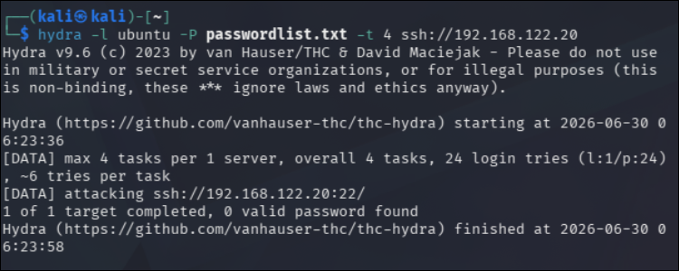
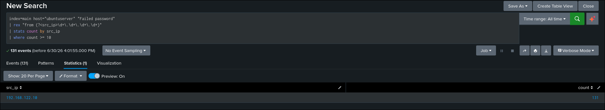
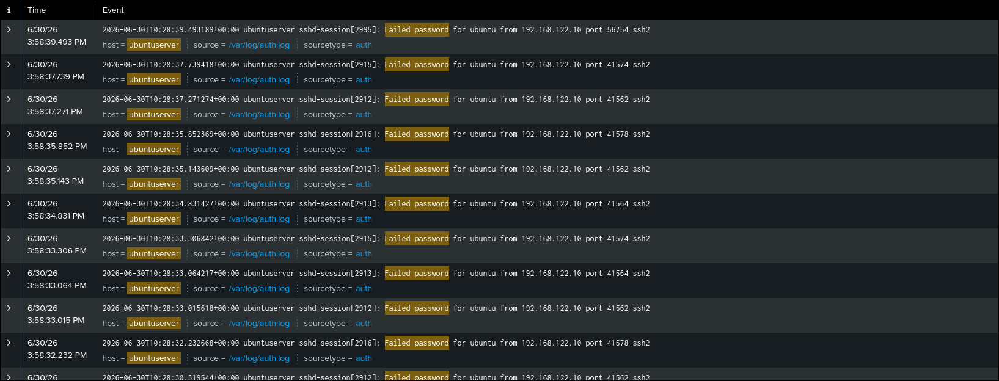
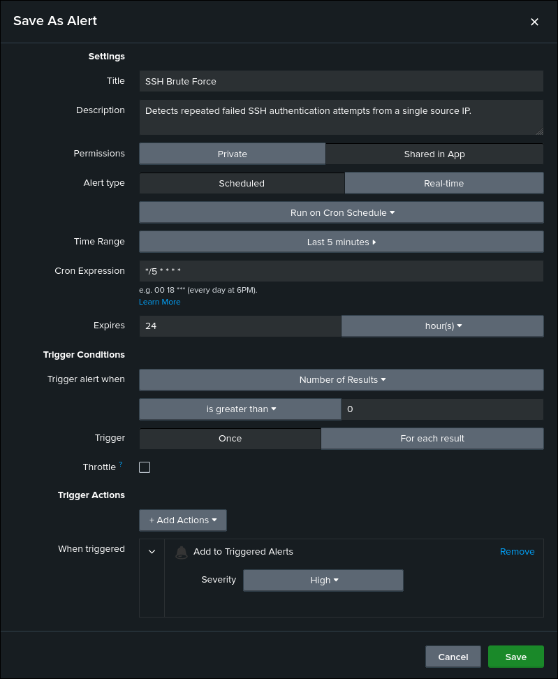

# SSH Brute Force Detection

## Objective

Detect repeated failed SSH authentication attempts originating from a single source IP using Ubuntu authentication logs.

## ATT&CK

**Technique**

* T1110.001 — Password Guessing

**Tactic**

* Credential Access

## Data Source

* Ubuntu Authentication Log (`/var/log/auth.log`)
* Splunk Universal Forwarder

## Attack Simulation

The following command was executed from the Kali Linux attacker machine to generate telemetry:

```bash
hydra -l ubuntu -P passwordlist.txt -t 4 ssh://192.168.122.20
```

> Replace `<TARGET_IP>` with the IP address of the Ubuntu server.

## Detection Logic

The detection searches Ubuntu authentication logs for failed SSH login attempts, extracts the source IP address using a regular expression, and counts the number of failures originating from each source.

If a source IP generates ten or more failed authentication attempts, the activity is flagged as a potential SSH brute-force attack.

## SPL Query

```spl
index=main host="ubuntuserver" "Failed password"
| rex "from (?<src_ip>\d+\.\d+\.\d+\.\d+)"
| stats count by src_ip
| where count >= 10
```

## Expected Output

The search returns source IP addresses that generated ten or more failed SSH authentication attempts.

Useful investigation fields include:

- src_ip
- count
- host
- _time
- raw event

## Validation

The detection was validated by performing an SSH brute-force attack from the Kali Linux attacker machine using Hydra and confirming that the corresponding authentication events were successfully ingested into Splunk.

## Detection Tuning

Consider excluding:

* Internal vulnerability scanners
* Approved penetration testing
* Security assessments
* Authentication testing performed by administrators

Adjust the threshold as necessary to match the environment.

## False Positives

Potential false positives include:

* Internal vulnerability assessments
* Authorized penetration testing
* User password mistyping
* Automated authentication testing

## MITRE Mapping

* T1110.001 — Password Guessing

## References

- MITRE ATT&CK – https://attack.mitre.org/techniques/T1110/001/
- Hydra Documentation – https://github.com/vanhauser-thc/thc-hydra

## Screenshots

| Screenshot | Preview |
|------------|---------|
| Execution |  |
| Search |  |
| Raw Event |  |
| Alert Configuration |  |
