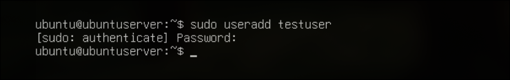
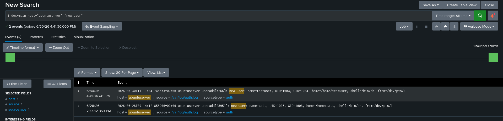
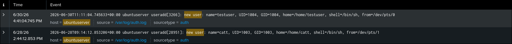
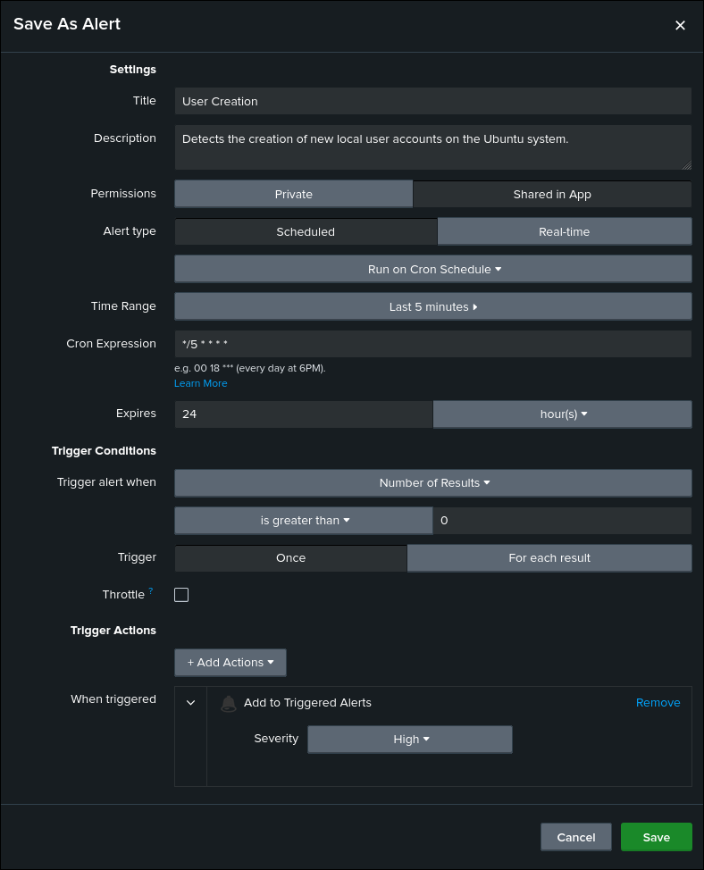

# User Creation Detection

## Objective

Detect the creation of new local user accounts on the Ubuntu server.

## ATT&CK

**Technique**

* T1136.001 — Local Account

**Tactic**

* Persistence

## Data Source

* Ubuntu Authentication Log (`/var/log/auth.log`)
* Splunk Universal Forwarder

## Attack Simulation

The following command was executed on the Ubuntu server to generate telemetry:

```bash
sudo useradd testuser
```

## Detection Logic

The detection searches Ubuntu authentication logs for events indicating the creation of new local user accounts.

Any event containing the `new user` message is identified, providing visibility into account creation activity that may indicate persistence or unauthorized administrative actions.

## SPL Query

```spl
index=main host="ubuntuserver" "new user"
```

## Expected Output

The search returns authentication events corresponding to newly created local user accounts.

Useful investigation fields include:

- host
- _time
- _raw
- source
- sourcetype

## Validation

The detection was validated by creating a new local user account on the Ubuntu server using the `useradd` command and confirming that the corresponding authentication event was successfully ingested into Splunk.

## Detection Tuning

Consider excluding:

* Approved administrator account creation
* Configuration management tools
* Automated provisioning systems
* User onboarding workflows

## False Positives

Potential false positives include:

* Legitimate administrator activity
* User provisioning
* Automated deployment tools
* Configuration management software

## MITRE Mapping

* T1136.001 — Local Account

## References

- MITRE ATT&CK – https://attack.mitre.org/techniques/T1136/001/
- Linux `useradd` Manual – https://man7.org/linux/man-pages/man8/useradd.8.html

## Screenshots

| Screenshot | Preview |
|------------|---------|
| Execution |  |
| Search |  |
| Raw Event |  |
| Alert Configuration |  |
