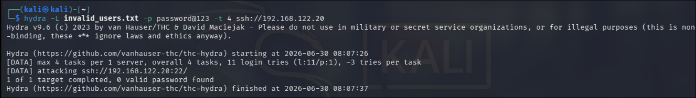
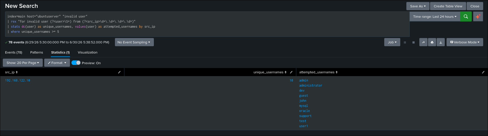
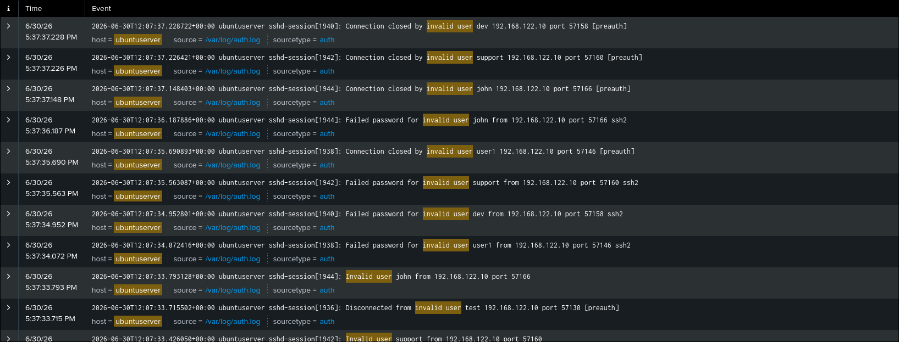
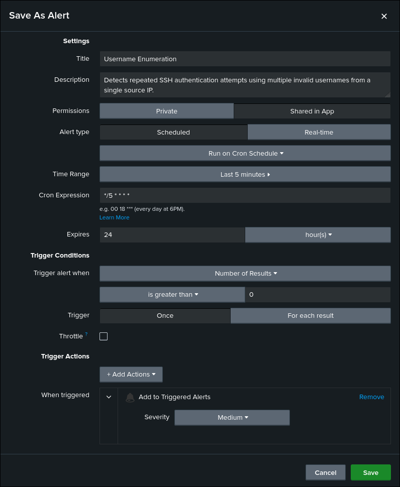

# Username Enumeration

## Objective

Detect repeated SSH authentication attempts using multiple invalid usernames from a single source IP.

## ATT&CK

**Technique**

* T1589.001 — Gather Victim Identity Information: Credentials

**Tactic**

* Reconnaissance

## Data Source

* Ubuntu Authentication Log (`/var/log/auth.log`)
* Splunk Universal Forwarder

## Attack Simulation

The following command was executed from the Kali Linux attacker machine to generate telemetry:

```bash
hydra -L invalid_users.txt -p Password123 -t 4 ssh://192.168.122.20
```

Where `invalid_users.txt` contains multiple usernames that do not exist on the Ubuntu server.

## Detection Logic

The detection searches Ubuntu authentication logs for SSH authentication attempts using invalid usernames.

A regular expression extracts the attempted username and source IP address. The search counts the number of unique invalid usernames attempted by each source IP.

If a source IP attempts five or more unique invalid usernames, the activity is flagged as potential username enumeration.

## SPL Query

```spl
index=main host="ubuntuserver" "invalid user"
| rex "for invalid user (?<user>\S+) from (?<src_ip>\d+\.\d+\.\d+\.\d+)"
| stats dc(user) as unique_usernames values(user) as attempted_usernames by src_ip
| where unique_usernames >= 5
```

## Expected Output

The search returns source IP addresses that attempted authentication using multiple invalid usernames.

Useful investigation fields include:

- src_ip
- unique_usernames
- attempted_usernames
- host
- _time

## Validation

The detection was validated by performing SSH authentication attempts against multiple non-existent user accounts from the Kali Linux attacker machine and confirming that the corresponding authentication events were successfully ingested into Splunk.

## Detection Tuning

Consider excluding:

* Internal vulnerability scanners
* Approved penetration testing
* Security assessments
* Authorized authentication testing

Adjust the username threshold where appropriate.

## False Positives

Potential false positives include:

* Internal vulnerability assessments
* Authorized penetration testing
* Security validation exercises
* Automated authentication testing

## MITRE Mapping

* T1589.001 — Gather Victim Identity Information: Credentials

## References

- MITRE ATT&CK – https://attack.mitre.org/techniques/T1589/001/
- Hydra Documentation – https://github.com/vanhauser-thc/thc-hydra

## Screenshots

| Screenshot | Preview |
|------------|---------|
| Execution |  |
| Search |  |
| Raw Event |  |
| Alert Configuration |  |
