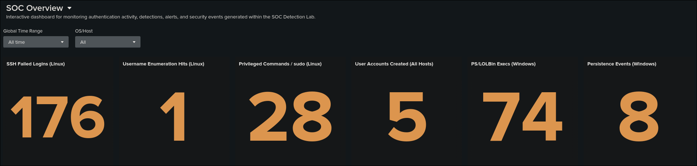
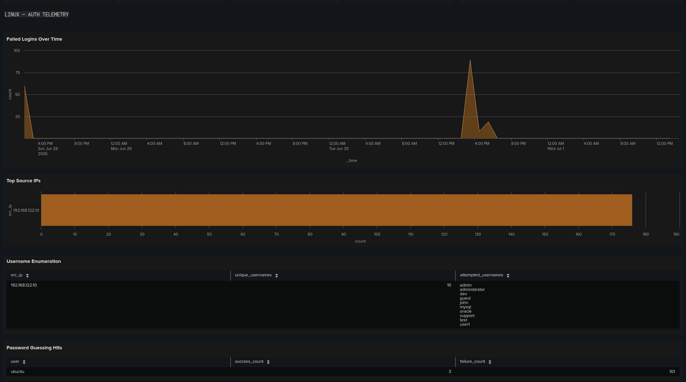
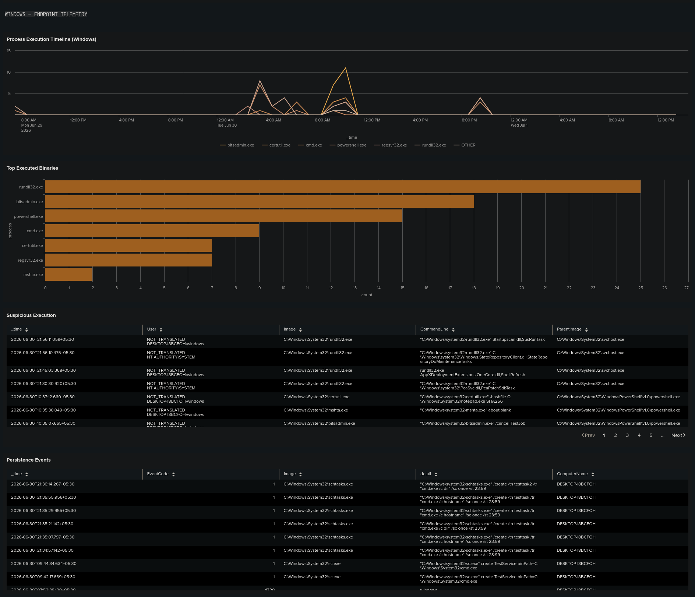

# SOC Overview Dashboard

## Objective

A single Splunk Dashboard Studio view that surfaces authentication activity, process execution telemetry, and detection results across both endpoints in the lab — the Ubuntu server (SSH/auth logs) and the Windows endpoint (Sysmon/Security event logs) — without requiring an analyst to run each detection search individually.

## Dashboard Layout

The dashboard is organized into three logical sections:

1. Environment summary (KPI row)
2. Linux authentication telemetry
3. Windows endpoint telemetry

This layout allows analysts to quickly identify suspicious activity before drilling into platform-specific investigations.

## Data Sources

| Source | Description |
|--------|-------------|
| Ubuntu Authentication Log | `/var/log/auth.log` forwarded by Splunk Universal Forwarder |
| Windows Security Log | Windows Security events (Event ID 4720, etc.) |
| Microsoft Sysmon | Sysmon Operational log (primarily Event ID 1 – Process Creation) |

Every panel is built directly on top of the SPL from the corresponding file in [detections](../detections), so panel behavior stays consistent with the documented detection logic rather than diverging into separate ad-hoc queries.

## Global Inputs

| Input | Token | Purpose |
|---|---|---|
| Global Time Range | `$global_time$` | Applied to every panel's search via `earliest`/`latest` query parameters |
| OS/Host | `$os_filter$` | Restricts panels to Linux-only, Windows-only, or all hosts |

### How the OS/Host filter works

Linux and Windows events don't share a common "platform" field — Linux events are identified by `host="ubuntuserver"`, Windows events by `source="WinEventLog:*"`. The dropdown doesn't filter an indexed field value; it swaps in a raw SPL fragment as a token:

| Label | `$os_filter$` value |
|---|---|
| All | `(host="ubuntuserver" OR source="WinEventLog:*")` |
| Linux | `host="ubuntuserver"` |
| Windows | `source="WinEventLog:*"` |

Every panel search is prefixed with `index=main $os_filter$ ...`. Selecting "Windows" correctly blanks out Linux-only panels (e.g. SSH Failed Logins) since there's no such thing as a Windows SSH login in this lab — that's expected behavior, not a bug.

Because every Splunk event carries both `host` and `source` as metadata regardless of sourcetype, `$os_filter$` can also be applied as a post-union filter (`| search $os_filter$`) on combined searches without needing a separate normalized field — see the **User Accounts Created** panel below.

## Panels

### KPI Row

Six single-value panels with sparkline trend, one per side of the environment plus one cross-host metric.

**SSH Failed Logins (Linux)** — Backed by [`ssh_brute_force.md`](../detections/ssh_brute_force.md)
```spl
index=main $os_filter$ host="ubuntuserver" "Failed password"
| rex "from (?<src_ip>\d+\.\d+\.\d+\.\d+)"
| stats count
```

**Username Enumeration Hits (Linux)** — Backed by [`username_enumeration.md`](../detections/username_enumeration.md)
```spl
index=main $os_filter$ host="ubuntuserver" "invalid user"
| rex "for invalid user (?<user>\S+) from (?<src_ip>\d+\.\d+\.\d+\.\d+)"
| stats dc(user) as unique_usernames values(user) as attempted_usernames by src_ip
| where unique_usernames >= 5
| stats count
```

**Privileged Commands / sudo (Linux)** — Backed by [`privileged_command_execution.md`](../detections/privileged_command_execution.md)
```spl
index=main $os_filter$ host="ubuntuserver" "COMMAND="
| stats count
```

**User Accounts Created (All Hosts)** — Aggregates: [`user_creation.md`](../detections/user_creation.md) and [`local_user_creation.md`](../detections/local_user_creation.md)
```spl
(index=main host="ubuntuserver" "new user")
OR
(index=main source="WinEventLog:Security" EventCode=4720)
| search $os_filter$
| stats count
```

**PS/LOLBin Execs (Windows)** — Aggregates: [`powershell_execution.md`](../detections/powershell_execution.md), [`encoded_powershell.md`](../detections/encoded_powershell.md), [`lolbin_execution.md`](../detections/lolbin_execution.md)
```spl
index=main $os_filter$ source="WinEventLog:Microsoft-Windows-Sysmon/Operational" EventCode=1
(Image="*\\powershell.exe" OR Image="*\\pwsh.exe" OR Image="*\\certutil.exe"
 OR Image="*\\mshta.exe" OR Image="*\\regsvr32.exe" OR Image="*\\rundll32.exe"
 OR Image="*\\bitsadmin.exe")
| stats count
```

**Persistence Events (Windows)** — Aggregates: [`scheduled_task_creation.md`](../detections/scheduled_task_creation.md), [`service_creation.md`](../detections/service_creation.md)
```spl
index=main $os_filter$ source="WinEventLog:Microsoft-Windows-Sysmon/Operational" EventCode=1
((Image="*\\schtasks.exe" CommandLine="*/create*")
 OR (Image="*\\sc.exe" CommandLine="*create*"))
| stats count
```

### Linux / Auth Telemetry

**Failed Logins Over Time** (area chart)
```spl
index=main $os_filter$ host="ubuntuserver" "Failed password"
| timechart span=1h count
```

**Top Source IPs** (bar chart)
```spl
index=main $os_filter$ host="ubuntuserver" "Failed password"
| rex "from (?<src_ip>\d+\.\d+\.\d+\.\d+)"
| stats count by src_ip
| where count >= 10
| sort -count
```

**Username Enumeration** (table) — Backed by [`username_enumeration.md`](../detections/username_enumeration.md)
```spl
index=main $os_filter$ host="ubuntuserver" "invalid user"
| rex "for invalid user (?<user>\S+) from (?<src_ip>\d+\.\d+\.\d+\.\d+)"
| stats dc(user) as unique_usernames values(user) as attempted_usernames by src_ip
| where unique_usernames >= 5
```

**Password Guessing Hits** (table) — Backed by [`password_guessing_success.md`](../detections/password_guessing_success.md)
```spl
index=main $os_filter$ host="ubuntuserver" ("Failed password" OR "Accepted password")
| rex "for (?:invalid user )?(?<user>\S+)"
| eval status=if(searchmatch("Accepted password"), "Success", "Failure")
| stats count(eval(status="Success")) as success_count count(eval(status="Failure")) as failure_count by user
| where failure_count >= 5 and success_count > 0
```

### Windows / Endpoint Telemetry

**Process Execution Timeline** (multi-series line chart, top 6 processes)
```spl
index=main $os_filter$ source="WinEventLog:Microsoft-Windows-Sysmon/Operational" EventCode=1
(Image="*\\cmd.exe" OR Image="*\\powershell.exe" OR Image="*\\pwsh.exe"
 OR Image="*\\certutil.exe" OR Image="*\\mshta.exe" OR Image="*\\regsvr32.exe"
 OR Image="*\\rundll32.exe" OR Image="*\\bitsadmin.exe")
| eval process=mvindex(split(Image,"\\"),-1)
| timechart span=1h count by process limit=6
```

**Top Executed Binaries** (bar chart)
```spl
index=main $os_filter$ source="WinEventLog:Microsoft-Windows-Sysmon/Operational" EventCode=1
(Image="*\\cmd.exe" OR Image="*\\powershell.exe" OR Image="*\\pwsh.exe"
 OR Image="*\\certutil.exe" OR Image="*\\mshta.exe" OR Image="*\\regsvr32.exe"
 OR Image="*\\rundll32.exe" OR Image="*\\bitsadmin.exe")
| eval process=mvindex(split(Image,"\\"),-1)
| stats count by process
| sort -count
```

**Suspicious Execution** (table) — Aggregates: [`encoded_powershell.md`](../detections/encoded_powershell.md), [`lolbin_execution.md`](../detections/lolbin_execution.md)
```spl
index=main $os_filter$ source="WinEventLog:Microsoft-Windows-Sysmon/Operational" EventCode=1
((Image="*\\powershell.exe" (CommandLine="*-enc*" OR CommandLine="*-EncodedCommand*"))
 OR (Image="*\\certutil.exe" OR Image="*\\mshta.exe" OR Image="*\\regsvr32.exe"
     OR Image="*\\rundll32.exe" OR Image="*\\bitsadmin.exe"))
| table _time, User, Image, CommandLine, ParentImage
| sort -_time
```

**Persistence Events** (table) — Aggregates: [`scheduled_task_creation.md`](../detections/scheduled_task_creation.md), [`service_creation.md`](../detections/service_creation.md), [`local_user_creation.md`](../detections/local_user_creation.md)
```spl
(index=main $os_filter$ source="WinEventLog:Microsoft-Windows-Sysmon/Operational" EventCode=1
 ((Image="*\\schtasks.exe" CommandLine="*/create*") OR (Image="*\\sc.exe" CommandLine="*create*")))
OR
(index=main $os_filter$ source="WinEventLog:Security" EventCode=4720)
| eval detail=coalesce(CommandLine, Account_Name)
| table _time, EventCode, Image, detail, ComputerName
| sort -_time
```

## Design Notes

* **Layout type:** Dashboard Studio, Grid — panels tile edge-to-edge with spacing controlled by the global Gutter Size setting (Canvas config), not by manual coordinate gaps.
* **Palette:** single warm amber accent (`#d98c3f`) across all single-series charts and KPI values, replacing Splunk's default purple. The one multi-series panel (Process Execution Timeline) uses a warm amber-to-brown ramp instead of a rainbow palette.
* **Background:** `#1f1d1a` panel background / `#181614` alternating table rows.
* **Section labels:** thin markdown panels (`` `LINUX — AUTH TELEMETRY` ``, `` `WINDOWS — ENDPOINT TELEMETRY` ``) separate the two halves of the dashboard without needing tabs.

## Known Limitations

- The `User` field in the Suspicious Execution table may display `NOT_TRANSLATED\<hostname>` when Sysmon cannot resolve a SID to a username. This originates from the Windows endpoint telemetry rather than the dashboard queries.

- The dashboard intentionally shows empty Linux-only or Windows-only panels when the OS/Host filter excludes the corresponding platform.

## Screenshots

### Dashboard Overview


### Linux authentication monitoring


### Windows endpoint monitoring


## Summary

The SOC Overview Dashboard provides a centralized operational view of the SOC Detection Lab by combining Linux authentication monitoring, Windows endpoint telemetry, and detection-specific metrics into a single Dashboard Studio interface. Every visualization is backed directly by documented detection logic, ensuring consistency between detections, alerts, and analyst workflows.
