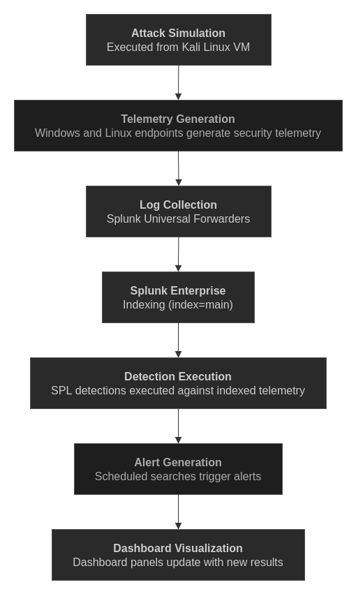

# Validation Workflow

## Overview

The SOC Detection Lab uses controlled attack simulations to generate realistic security telemetry for detection engineering, alert validation, dashboard development, and analyst playbook validation.

All simulations were performed within an isolated virtual environment consisting of a Windows 10 endpoint, an Ubuntu Server, and a Kali Linux attacker VM. Generated telemetry was forwarded to Splunk Enterprise using Splunk Universal Forwarders and validated against the corresponding detections.

Every detection, alert, dashboard visualization, and playbook within this repository is derived from telemetry generated through repeatable attack simulations.

## Lab Environment

| System | Purpose |
|---------|---------|
| Kali Linux | Attacker VM used to perform attack simulations |
| Ubuntu Server | Target system generating SSH authentication and administrative telemetry |
| Windows 10 | Endpoint generating Sysmon and Windows Security telemetry |
| Splunk Enterprise | Centralized log collection, detection, alerting, and dashboard visualization |

## Validation Workflow



The validation workflow illustrates how attack simulations generate endpoint telemetry that is collected by Splunk, processed through detection logic, converted into scheduled alerts, and ultimately visualized through the SOC dashboard.

## Linux Validation

The Ubuntu Server generates authentication and administrative telemetry through `/var/log/auth.log`.

The following attack simulations were performed during validation:

| Simulation | Purpose | Related Detection |
|------------|---------|-------------------|
| SSH Brute Force | Generate repeated failed authentication attempts | SSH Brute Force |
| Password Guessing | Generate failed attempts followed by a successful login | Password Guessing Success |
| Username Enumeration | Generate multiple invalid username attempts | Username Enumeration |
| User Creation | Generate local account creation telemetry | User Creation |
| Privileged Command Execution | Generate sudo activity | Privileged Command Execution |

Representative commands included:

```bash
hydra -l ubuntu -P wordlist.txt ssh://<TARGET_IP>

sudo useradd testuser

sudo apt update
```

Complete commands and validation steps are documented within each individual detection.

## Windows Validation

The Windows endpoint generates telemetry through Sysmon Process Creation events and Windows Security auditing.

The following attack simulations were performed during validation:

| Simulation | Purpose | Related Detection |
|------------|---------|-------------------|
| CMD Execution | Generate process creation events | CMD Execution |
| PowerShell Execution | Generate PowerShell process telemetry | PowerShell Execution |
| Encoded PowerShell | Generate obfuscated PowerShell telemetry | Encoded PowerShell |
| LOLBin Execution | Generate Living-off-the-Land binary executions | LOLBin Execution |
| Scheduled Task Creation | Generate persistence telemetry | Scheduled Task Creation |
| Service Creation | Generate Windows service creation events | Service Creation |
| Local User Creation | Generate Security Event ID 4720 | Local User Creation |

Representative commands included:

```cmd
cmd.exe

powershell.exe -Command whoami

powershell.exe -EncodedCommand ...

schtasks /create ...

sc.exe create ...

net user testuser test1234 /add
```

Complete commands and validation steps are documented within each individual detection.

## Generated Telemetry

### Linux

- SSH authentication failures
- SSH authentication successes
- Invalid username attempts
- sudo command execution
- Local user creation events

### Windows

- Sysmon Process Creation (Event ID 1)
- Windows Security User Account Creation (Event ID 4720)

This telemetry is forwarded into Splunk Enterprise and serves as the data source for every documented detection, alert, dashboard panel, and analyst playbook.

## Validation Process

Each detection was validated using the following methodology:

1. Execute the attack simulation.
2. Verify telemetry generation on the endpoint.
3. Confirm successful log ingestion into Splunk Enterprise.
4. Execute the corresponding SPL detection.
5. Verify scheduled alert generation.
6. Confirm dashboard panels update with the expected results.
7. Capture execution, SPL search, and raw event screenshots for documentation.

## Related Documentation

- [Architecture](architecture.md)
- [Telemetry](telemetry.md)
- [Detections](detections.md)
- [Dashboards](dashboards.md)


## Summary

The validation workflow provides a repeatable process for confirming that telemetry is successfully generated, ingested, detected, alerted on, and visualized within the SOC Detection Lab. By validating every detection against real endpoint activity, the repository demonstrates an end-to-end detection engineering workflow from attack simulation through analyst-facing dashboards and playbooks.
